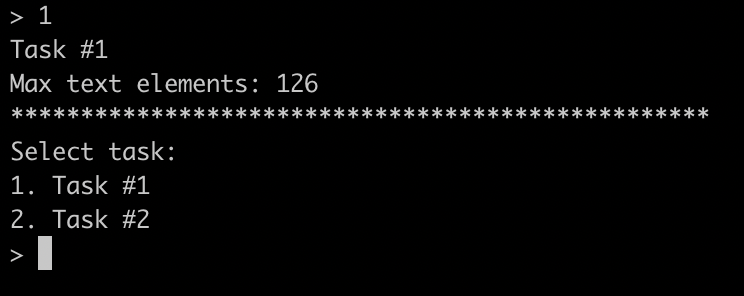
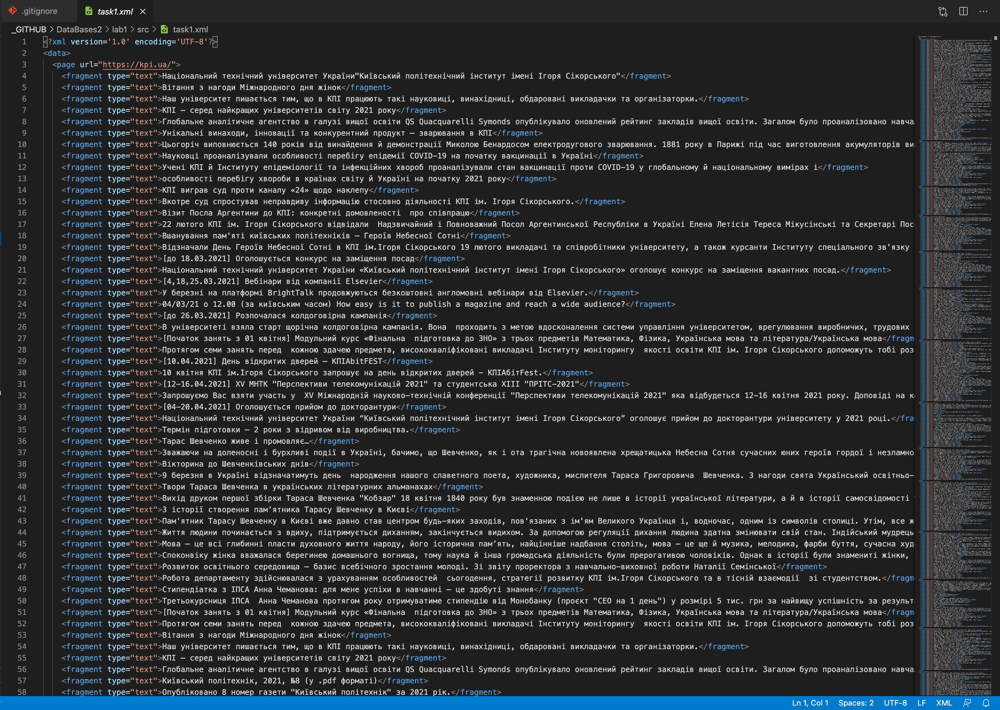
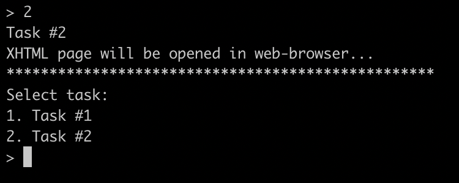
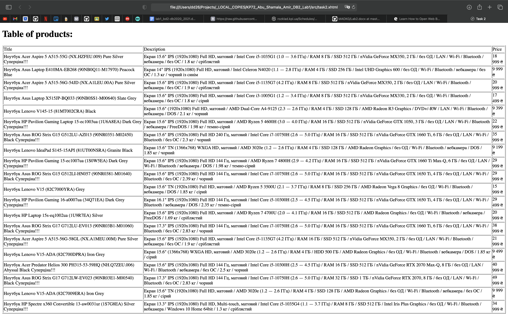

# Лабораторна робота 1: Вивчення базових операцій обробки XML-документів

Шаповалов Данило Дмитрович, КП-83

## Завдання
##### Варіант 21 (1)
| Базова сторінка | Зміст завдання 2     | Адреса інтернет-магазину |
|------------------------------|----------------------|---------------------------------------|
| www.kpi.ua | Максимальна кількість текстових фрагментів | www.rozetka.ua |

## Приклади роботи програми

___

___

___

___

