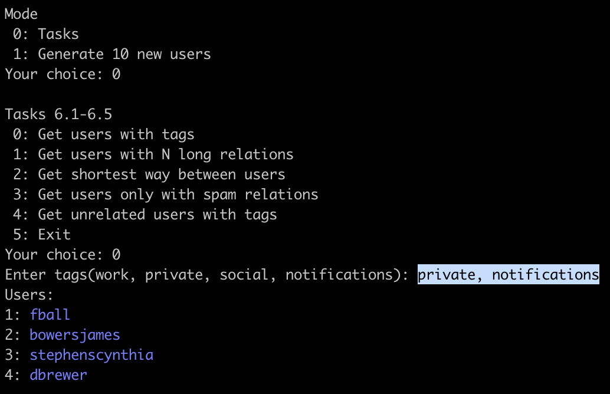
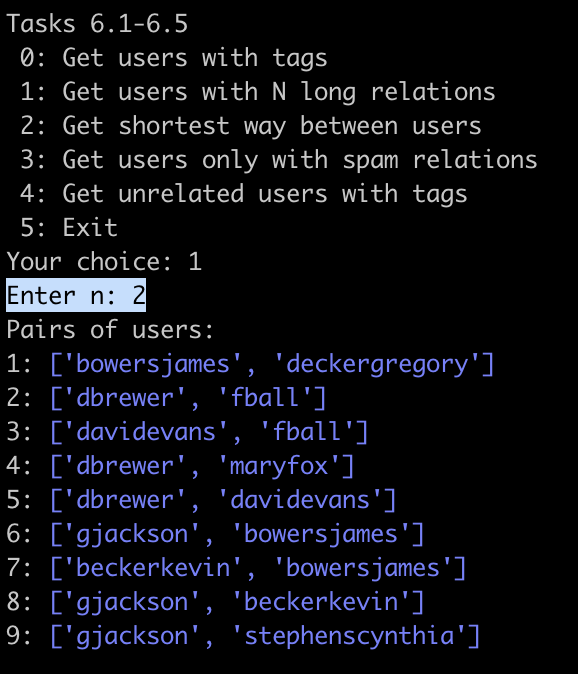
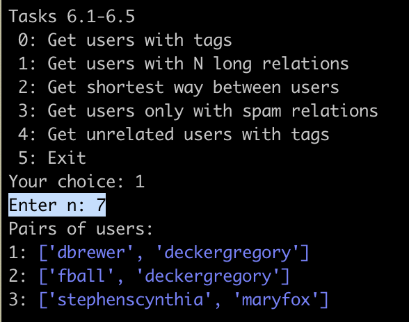
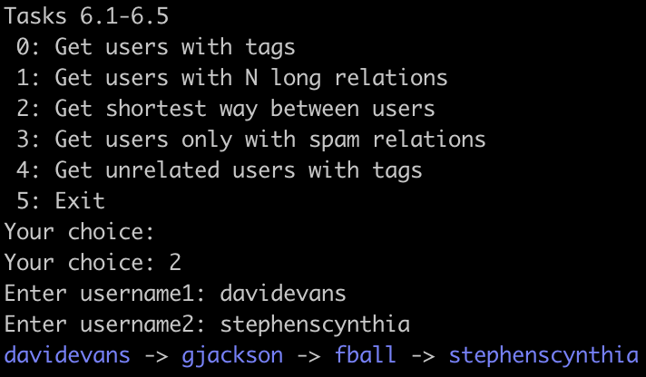
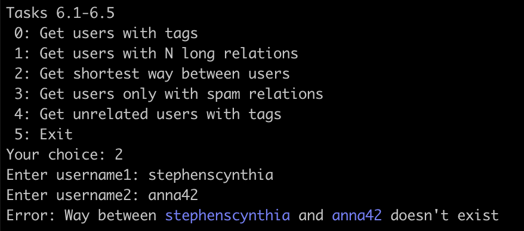
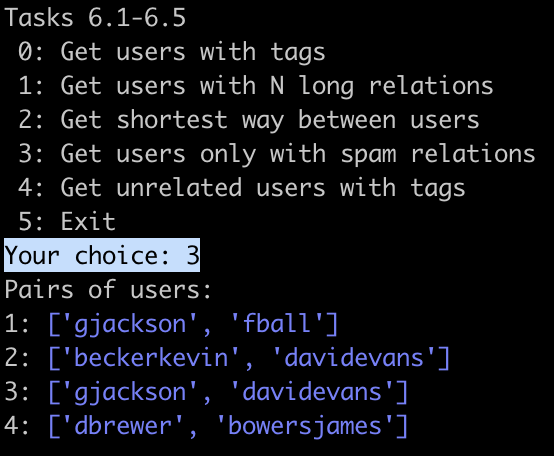
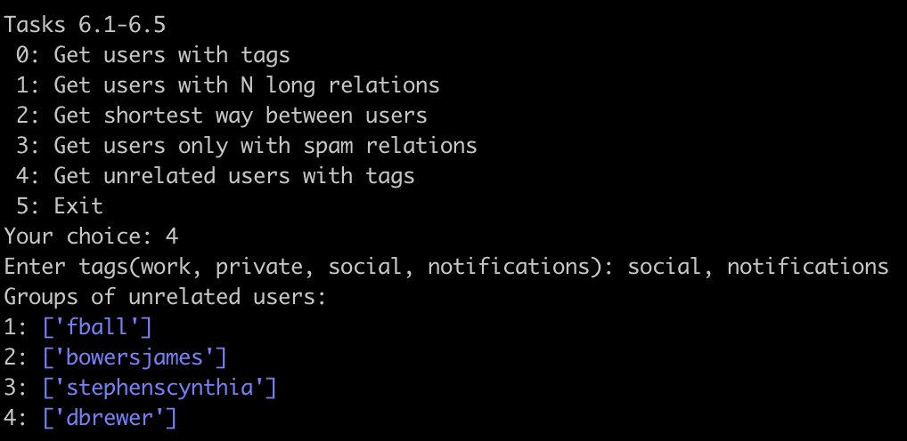
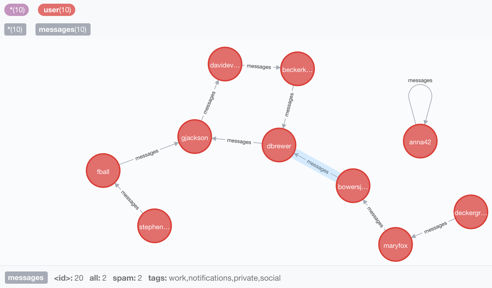

Лабораторна робота No 3.Практика використання графової бази даних Neo4J

Шаповалов Данило Дмитрович, КП-83
=====================

-----------------------------------
Приклади роботи програми
-----------------------------------
Пункт 6.1
-----------------------------------

-----------------------------------
Пункт 6.2
-----------------------------------

-----------------------------------
Пункт 6.3
-----------------------------------

-----------------------------------
Пункт 6.4
-----------------------------------

-----------------------------------
Пункт 6.5
-----------------------------------

-----------------------------------
Ноди БД
-----------------------------------

